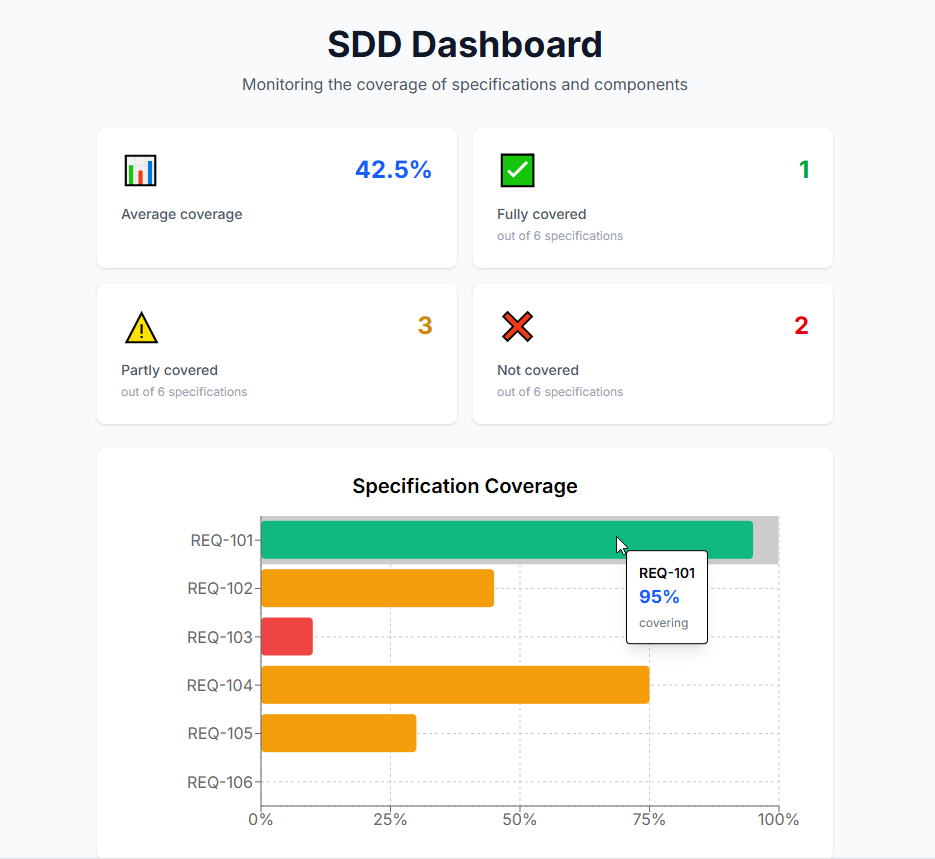
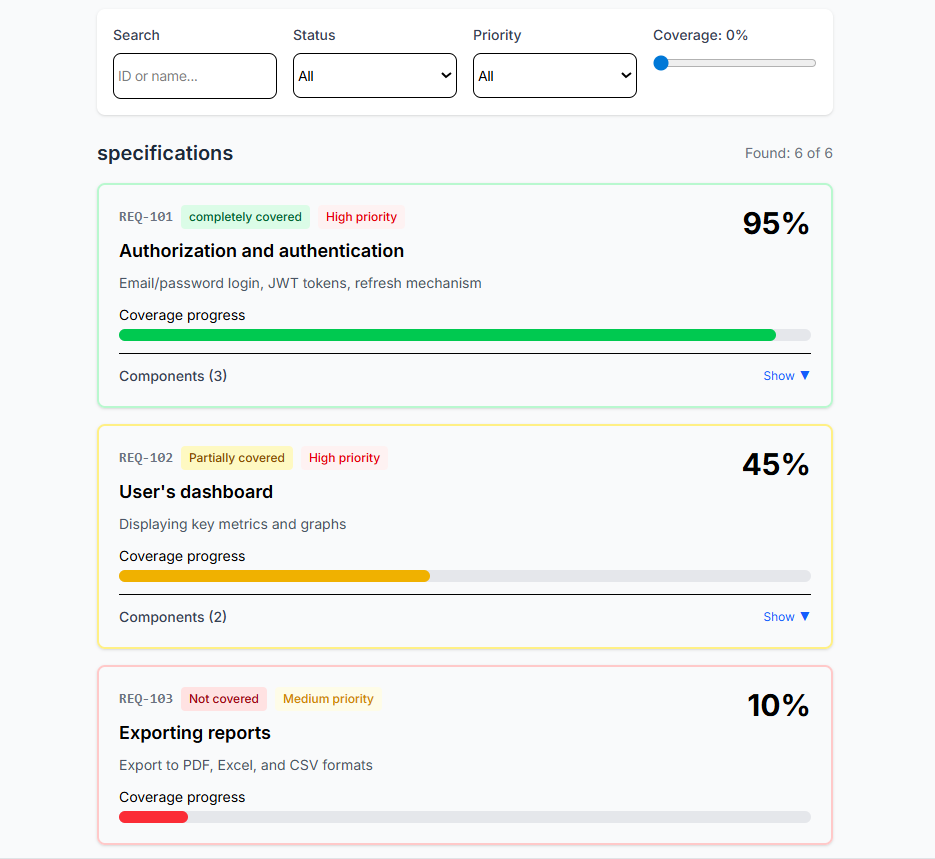

# SDD Dashboard

[](https://opensource.org/licenses/MIT)
[](https://github.com/yourusername/sdd-navigator-dashboard/pulls)
[](https://www.typescriptlang.org/)
[](https://nextjs.org/)
[](https://tailwindcss.com/)

<p align="left">
  <a href="README.md">English</a>
</p>

## 📋 О проекте

SDD Dashboard — веб-приложение для мониторинга покрытия спецификаций, которое позволяет:
- Отслеживать метрики покрытия
- Анализировать статус каждой спецификации
- Фильтровать и искать спецификации по различным критериям

Проект построен на технологии Next.js и демонстрирует:
- Клиент-серверную архитектуру с REST API
- Интерактивные графики и визуализацию данных
- Эмуляцию бэкенда через API Routes Next.js

## ▶️ Демо

**[Попробовать приложение онлайн](https://sdd-dashboard-delta.vercel.app)** 

## ⚙️ Функциональность

- **Метрики покрытия** — общий процент покрытия, статистика по статусам
- **Визуализация данных** — горизонтальная гистограмма покрытия каждой спецификации
- **Фильтрация** — по статусу, приоритету, минимальному покрытию
- **Поиск** — по ID и названию спецификации
- **Детальная информация** — описание, компоненты
- **API эмуляция** — REST API через Next.js API Routes
- **Интерактивные карточки** — раскрывающиеся списки компонентов

## 🛠️ Стек технологиий

**Frontend:**
- Next.js — React-фреймворк
- TypeScript — типизация
- Tailwind CSS — стилизация
- Recharts — графики

**Backend (эмуляция):**
- Next.js API Routes — REST API эндпоинты
- JSON — хранение данных

## 📸 Скриншоты интерфейса

<table>
  <tr>
    <th width="50%">Статистика</th>
    <th width="50%">Фильтры и спецификации</th>
  </tr>
  <tr>
    <td align="center">
      
     </td>
    <td align="center">
      
     </td>
  </tr>
</table>

## 🧱 Архитектура проекта

<details>
<summary>Нажмите, чтобы развернуть</summary>

SDD-DASHBOARD/<br>
├── app/<br>
│   ├── api/<br>
│   │   └── specs/<br>
│   │       └── route.ts       # Обработчик маршрута<br>
│   ├── components/<br>
│   │   ├── CoverageChart.tsx  # Гистограмма<br>
│   │   ├── Filters.tsx        # Фильтры<br>
│   │   ├── SpecCard.tsx       # Карточки спцификаций<br>
│   │   └── StatsCards.tsx     # Статистика<br>
│   ├── layout.tsx             # Точка входа<br>
│   └── page.tsx               # Главная страница<br>
├── data/<br>
│   └── specifications.json    # Список спецификаций<br>
└── README.md

</details>

## 💾 Структура данных

```json
{
  "totalCoverage": 62.3,
  "specifications": [
    {
      "id": "REQ-102",
      "title": "User Dashboard",
      "description": "Display of key metrics and charts",
      "coverage": 45,
      "status": "partial",
      "components": ["DashboardLayout", "MetricCard"],
      "priority": "high"
    },
  ]
}
```

**Основные сущности:**
- `specifications` — спецификации с метриками покрытия
- `coverage` — процент покрытия (0-100)
- `status` — статус покрытия (covered/partial/missing)
- `priority` — приоритет спецификации (high/medium/low)
- `components` — связанные компоненты

## 🧪 Тестирование

В проекте используется связка:
- Jest
- React Testing Library

Тестами покрыты:
- UI компоненты (Filters, SpecCard, StatsCards, CoverageChart)
- Логика фильтрации и отображения данных

Тесты связаны с требованиями через идентификаторы:
```ts
// @req SDD-UI-002
test('SDD-UI-002: calculates average coverage correctly', ...)
```

**Запуск тестов:**
```bash
npm test
```

## 🖐️ Ручной запуск приложения

**Требования:**
- Node.js v22+
- npm или yarn

**1. Клонировать репозиторий:**
```bash
git clone https://github.com/paper-apple/sdd-dashboard.git
cd sdd-dashboard
```

**2. Установить зависимости:**
```bash
npm install
```

**3. Запустить приложение:**
- Запуск в режиме разработки
```bash
npm run dev
```

- Запуск в режиме продакшена
```bash
npm run build
npm run start
```

**4. Открыть приложение:**
- Приложение доступно по адресу: [http://localhost:3000](http://localhost:3000)

## 📞 Контакты

[](birdcherrytea@gmail.com)</br>
[](https://t.me/submarino_amarillo)</br>
[](https://www.linkedin.com/in/dzmitry-paklonski/)